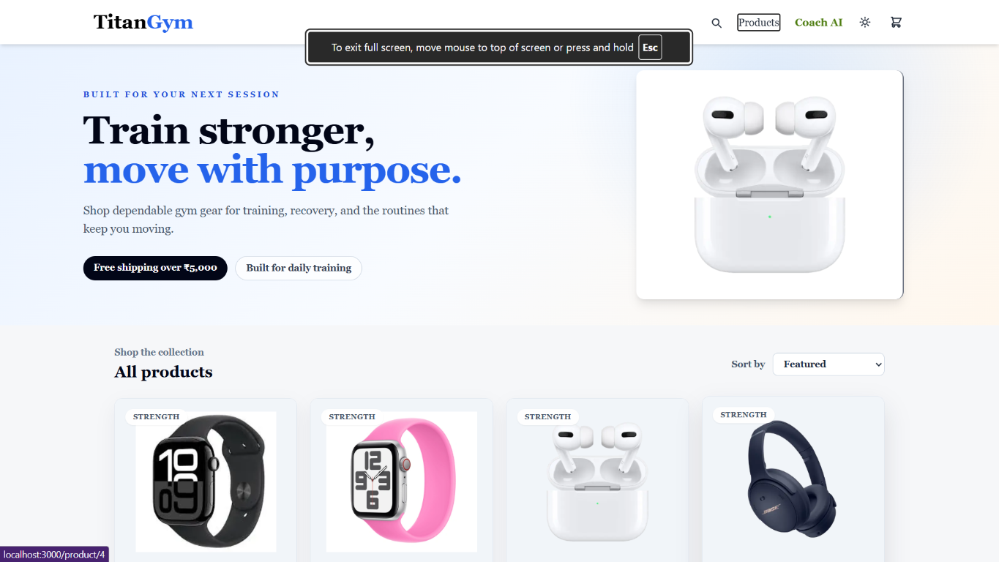
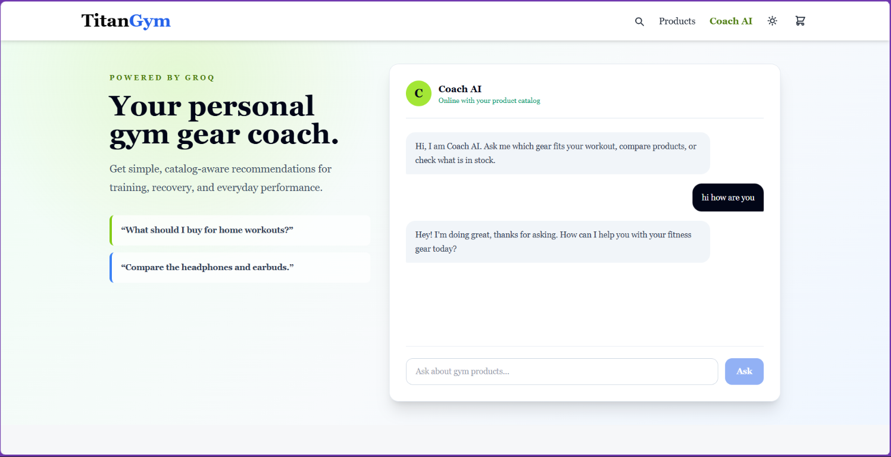

# TitanGym — Gym-focused E-commerce Store



TitanGym is a focused e-commerce storefront offering gym and fitness products, with an integrated Coach AI for catalog-aware product guidance. The project combines a React frontend and a Spring Boot backend and includes Razorpay test-mode payment integration for India.

---

## Key Highlights

- India-first storefront: INR pricing and formatting throughout the UI
- Coach AI: catalog-aware assistant (Groq integration with fallback)
- Razorpay test-mode checkout (backend order creation + frontend modal)
- Fullstack stack: React (frontend) + Spring Boot (backend) + PostgreSQL
- Developer-friendly: can be run locally without Docker

---

## Screenshots

Coach AI (chat assistant):



Storefront (product grid):


> Note: the images above reference the local attachment paths so they render in a local environment or VS Code preview. If you want them to display on GitHub, copy the two image files into the repo (e.g. `docs/images/`) and update these paths accordingly.

---

## Quick start — Local (no Docker)

1. Frontend

```bash
cd frontend
npm install
# point frontend to local backend (default: http://localhost:8082)
npm start
```

2. Backend

Ensure PostgreSQL is available and create a DB (example: `ecommerce_db`). Then set environment variables and run:

```powershell
$env:DB_URL='jdbc:postgresql://localhost:5432/ecommerce_db'
$env:DB_USERNAME='postgres'
$env:DB_PASSWORD='your_db_password'
$env:JWT_SECRET='replace_with_secure_secret'
# Optional: for Razorpay test flow
$env:RAZORPAY_KEY_ID='rzp_test_TWh3DAkJq3jh7b'
$env:RAZORPAY_KEY_SECRET='HmYRDfj132IrXmYJEw2eIpGU'
cd backend
mvn spring-boot:run
```

3. Checkout flow

- Open the frontend at `http://localhost:3000` and place an order.
- The frontend will call the backend order endpoint (`/api/v1/payment/create-order`) to create a Razorpay order, then open the Razorpay checkout modal using the `RAZORPAY_KEY_ID` from the server response.

---

## Environment variables

Backend (important):

- DB_URL — JDBC URL for PostgreSQL
- DB_USERNAME
- DB_PASSWORD
- JWT_SECRET
- RAZORPAY_KEY_ID (optional, for test checkout)
- RAZORPAY_KEY_SECRET (optional, for test checkout)
- GROQ_API_KEY (optional for Coach AI)

Frontend (important):

- REACT_APP_API_URL — base URL for backend API (default `http://localhost:8082`)

---

## Notes & next steps

- The repository currently includes a working Razorpay integration in test mode. Do not commit secret keys — set them as environment variables when starting the backend.
- To make screenshots visible on GitHub, copy the two attached screenshot files into the repository under `docs/images/` and update the image links in this README accordingly.

---

## Contributing

Contributions, issues and feature requests are welcome. Please follow standard fork-and-pull-request workflow.

---

Co-authored-by: Copilot <223556219+Copilot@users.noreply.github.com>